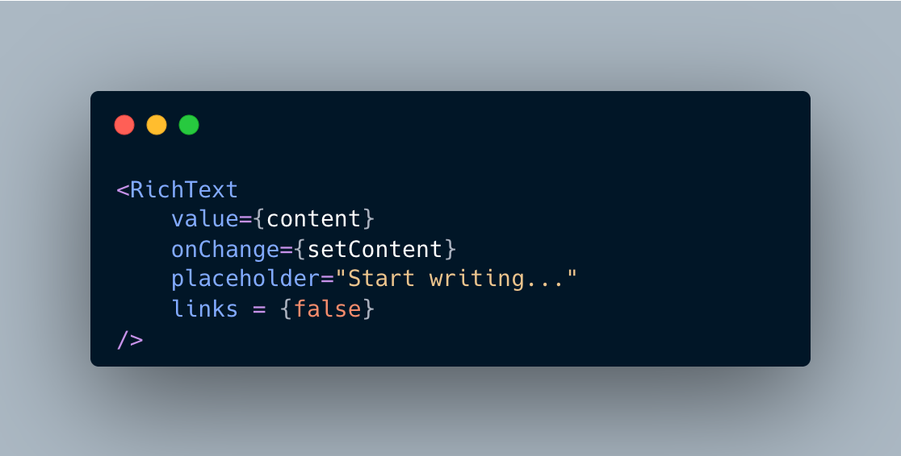

# ee-richtext

A responsive and customizable rich-text editor for React.

## Installation

```bash
npm install ee-richtext
```

## Usage

```jsx
import { useState } from "react";
import { RichText } from "ee-richtext";

function App() {
  const [content, setContent] = useState("");

  return (
    <RichText
      value={content}
      onChange={setContent}
      placeholder="Start writing..."
    />
  );
}

export default App;
```

You can also use the default import:

```jsx
import RichText from "ee-richtext";
```

## Simple mode

```jsx
<RichText
  value={content}
  onChange={setContent}
  simple
/>
```

## Disable features

```jsx
<RichText
  value={content}
  onChange={setContent}
  media={false}
  table={false}
  links={true}
/>
```


## Usage Example

```jsx
<RichText
  value={content}
  onChange={setContent}
  placeholder="Start writing..."
  links={false}
/>
```

<p align="center">
  
</p>


## Props

| Prop | Type | Default | Description |
|---|---|---|---|
| `value` | `string` | `undefined` | HTML content |
| `onChange` | `function` | `undefined` | Receives updated HTML |
| `placeholder` | `string` | `"Start writing…"` | Placeholder text |
| `minHeight` | `number` | `320` | Minimum editor height |
| `media` | `boolean` | `true` | Enables image tools |
| `table` | `boolean` | `true` | Enables table tools |
| `links` | `boolean` | `true` | Enables link tools |
| `simple` | `boolean` | `false` | Enables simplified mode |

## License

MIT